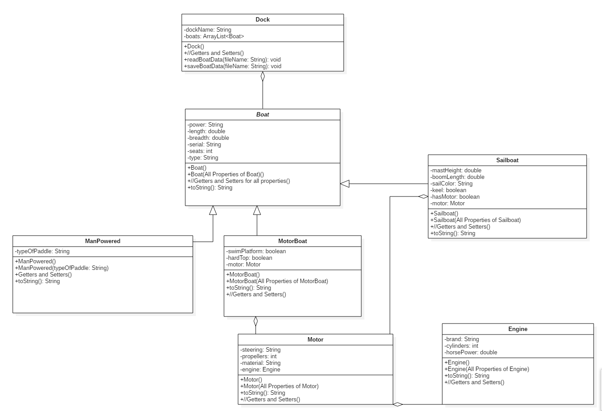

# Fall-2019-Major-Program-2
## COMP 167 Fall 2019
### Due October 25th 2019 @ 8:00 pm
#### Submissions that are late are deducted 20 points each day they are late. After 2 days of being late the grade will be an automatic 0.

##  Introduction

This assignment requires you to create a Java application that will be used to inventory boats in a dock.  In addition to the classes that store the boat data, you will create a GUI to manage the inventory.

## Git and GitHub

You will submit this project using GitHub pull requests. You **must** create a GitHub pull request for each level to receive credit. You should request your assigned reviewer on your pull request. Review the following resource on git and GitHub for major programs _before_ you start work:

- [Written Explanation](https://gist.github.com/ccannon94/511115be821a873ae9ec5f4db9cfdda0)
- [YouTube Video](https://www.youtube.com/watch?v=l2bP9JKQkdA)

You **must** complete all work on a separate branch. You CAN NOT push code to the master branch. Review the above git and GitHub resources to learn about branching.

You **must** add your assigned TA as a reviewer for your pull requests. You can find your assigned reviewer [here](./assigned-reviewers.csv). 

## UML Domain Diagram



## Classes

You are required to implement all of the classes listed in the UML Domain Diagram above. Below are additional details that could provide some help for certain classes.

### Boat Class (Abstract)

This class's toString method returns each property seperated by a comma.

### MotorBoat Class

Some motor boats have a swim platform and/or a hard top. This class's toString method returns each property seperated by a comma. 

### Motor

This class's toString method returns each property seperated by a System.lineSeperator()

### Sailboat

This class's toString method returns each property seperated by a comma. Most modern Sailboats have motors in them. If the Sailboat does not have a motor, do not add motor info to it's toString, but add motor info if it does have a motor.

### Engine

This class's toString method returns each property seperated by a comma.

### Dock Class


### Handling ArrayLists

Each ArrayList should have five associated methods to perform: getNum, add, remove, get and set.  So if you have an ArrayList named widgets that stored items of type Widget, then the associated UML behaviors would be:

```
+getNumWidgets() : int  //Return the number of items in the ArrayList widgets.
+getWidget(index:int) : Widget  //get the Widget at location index in ArrayList widgets
+setWidget(index:int, item:Widget):void	 //store item at location index in the ArrayList widgets.
+addWidget(item:Widget):void   //Append the Widget to the ArrayList.
+removeWidget( index:int ) : Widget  //remove and return the Widget at location index
```

### toString() Methods

The `toString()` method for _each_ concrete subclass of `Boat` must include a letter designating the subtype. "B" for `ManPoweredBoat`, "M" for `MotorBoat`, and "S" for `Sailboat`. This should be the first property displayed. Follow the `Input File` for more details on how each property should be displayed.

Properties should be returned in the order they are listed in the UML diagram, from superclass to subclass. Some subclass properties are seperated by a lineSeperator.

## Input File

The name of the input file will be supplied using command-line arguments.  If no command-line argument is supplied, then your program should prompt the user for the input file using the `JFileChooser` class.  Here is the format of the input file:

```
dockName
boat0power,length,breadth,serial,seats,type,typeOfPaddle
boat1power,length,breadth,serial,seats,type, swimPlatform, hardTop
boat1steering
boat1propellers
boat1material
boat1brand,cylinders,horsePower
boat2power,length,breadth,serial,seats,type,mastHeight,boomLength,sailColor,keelCheck,motorCheck
...
boatNpower,length,breadth,serial,seats,type, **Followed by type of boats properties**
//If boat has motor, each property of motor is seperated by a System.lineSeperator()
boatNsteering
boatNpropellers
boatNmaterial
boatNbrand,cylinders,horsePower
```

## Output File

The format for the output file should be identical to that of the input file.  In other words, after writing your output file, you should be able to read it back in as an input file.  The `toString()` methods of your classes are designed to make file output simple.

## Graphical User Interface

Your program should implement a GUI. This GUI should have 2 buttons. One button to load up an existing dock via `JFileChooser` and one button to save all of the docks info to a text file. The button that loads the existing dock should display all of the boats that are in the dock via `ListView` and show the name of the dock somewhere on the GUI. There should be a button for a user to input any 3 types of boats. An example is shown in the image below.

### 


## Grading

If your project does not compile, it receives a grade of zero. 

### Level 1 (35 points)
Implement all the classes except the `Dock` class.

### Level 2 (20 points)
Implement the `Dock` class except the `readBoatData()` and `saveBoatData()` methods.  Use the `main()` method to create one of each type of concrete class and add them to the `ArrayList`.  Output the contents of the boats object to a JOptionPane using the toString() method of the each boat inside the object.

### Level 3 (20 points)
Modify your main so that it uses command-line arguments to provide the input file name.  Add the logic to obtain the input file name from a `JFileChooser` if no command-line argument is provided.  Implement the `readBoatData()` and `saveSaveData()` methods.   To prove your code works, read the input file and add additional boats by creating objects in the main method and adding them to the `boats` object.  Save the updated `boats` object using the `saveBoatData()` method.

### Level 4 (25 points)
Implement the GUI.
